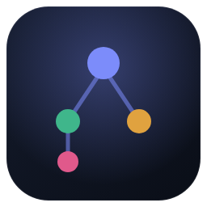

<p align="center">
  
</p>

<h1 align="center">Claude Tree</h1>

<p align="center">
  <b>Fork your Claude Code sessions like git branches.</b><br/>
  <sub>📖 <a href="#-tiếng-việt">Đọc bằng Tiếng Việt ↓</a></sub>
</p>

> 🧩 **This is for [Claude Code](https://docs.anthropic.com/en/docs/claude-code) — the AI coding agent that runs in your terminal.**
> It is **not** the Claude desktop chat app. Different tools: Claude Code edits your codebase; Claude Tree
> organizes and branches its conversation history — something neither the CLI nor the chat app gives you.

**Why?** A Claude Code session builds up valuable context. When you want to try several directions, cramming
them into one session dilutes that context — and starting fresh throws it away. Claude Tree turns every session
into a visual tree so you can **fork** any conversation (from the end, *or any message in the middle*) into a new
branch and keep working in a real terminal — while the original stays perfectly intact.


## Quickstart

> Requires [Node.js ≥ 18](https://nodejs.org) and the [Claude Code CLI](https://docs.anthropic.com/en/docs/claude-code).

```bash
git clone https://github.com/Marshal-Nguyen/Manage_Claude_Session.git claude-tree
cd claude-tree
npm run setup
npm start        # → http://localhost:4799
```

That's it. Your sessions appear automatically.

> **Optional — click-to-launch app** (starts the server + opens the app in its own window):
> - **Linux:** `bash scripts/install-launcher.sh` → adds a "Claude Tree" icon to your app menu
> - **macOS:** double-click `scripts/install-launcher.command` → creates a **Claude Tree.app**
>   (with icon) in `~/Applications`. Or just run `scripts/claude-tree-app.command` directly.
> - **Windows:** run `powershell -ExecutionPolicy Bypass -File scripts\install-launcher.ps1`
>   → Desktop + Start Menu shortcuts with icon. Or double-click `scripts\claude-tree-app.cmd`.
>
> All three install a real desktop app with its own icon — like any other app in your dock/menu:
>
> 
>
> *Linux launcher is tested; macOS/Windows are written but community-testing welcome.*

## What you can do

- ⑂ **Fork → Terminal** — click fork, a terminal opens on the new branch, chat with the full CLI
- 💬 **Fork from any message** — hover a message, hit ⑂, branch from that exact point
- 🔍 **Search everything** — full-text search across all your conversations
- 📖 **Read comfortably** — markdown rendering, tool noise filtered, parent history collapsed
- ⤓ **Export** — any session to Markdown or JSON

<details>
<summary><b>⚙️ Configuration</b></summary>

| Env var | Default | What it does |
|---|---|---|
| `PORT` | `4799` | App port |
| `CLAUDE_PROJECTS_DIR` | `~/.claude/projects` | Where Claude Code stores sessions |
| `CLAUDE_TREE_TERMINAL` | auto-detect | Force a terminal emulator (e.g. `kitty`) |

Dev mode with hot reload: `./start.sh` (Linux/macOS) — on Windows run
`node server/index.js` and `npm run dev --prefix web` in two terminals.
</details>

<details>
<summary><b>🔒 Is forking safe? Where does my data go?</b></summary>

Forking copies the conversation prefix into a **new** session file — exactly what Claude
Code's native `--fork-session` does. Your original session file is never modified.
Deleting a session moves it to `server/.trash/` (recoverable).

Everything runs **locally**: the server binds to `127.0.0.1` only, no data leaves your
machine. Chat/Fork spawn your own `claude` CLI and use your own API quota.
</details>

<details>
<summary><b>💻 Platforms & troubleshooting</b></summary>

| Platform | Status |
|---|---|
| Linux | ✅ Tested |
| macOS | 🟡 Implemented (Terminal.app) — testers welcome |
| Windows | 🟡 Implemented (Windows Terminal / cmd) — testers welcome |

- **`claude` CLI not found at startup** → *not an error.* Viewing, search and export work fine;
  only Chat & Fork need the [Claude Code CLI](https://docs.anthropic.com/en/docs/claude-code).
- **"Cannot reach backend"** → run `npm start`, then retry.
- **Port in use** → `PORT=5000 npm start`.
- **Chat/Fork fails** → check `claude --version` works in your terminal.
- **First search is slow** → it indexes once, then it's fast.

Works down to phone-width screens (sidebar becomes a drawer ☰).
</details>

---

# 🇻🇳 Tiếng Việt

**Quản lý và phân nhánh các phiên chat Claude Code như nhánh Git.**

> 🧩 **Đây là công cụ cho [Claude Code](https://docs.anthropic.com/en/docs/claude-code) — agent lập trình chạy trong terminal.**
> **KHÔNG phải** app chat Claude Desktop. Hai thứ khác nhau: Claude Code sửa code dự án của bạn;
> Claude Tree quản lý & phân nhánh lịch sử hội thoại của nó — thứ mà cả CLI lẫn app chat đều không có.

**Để làm gì?** Một phiên Claude Code tích lũy ngữ cảnh quý giá. Khi muốn thử nhiều hướng, hỏi dồn vào
một phiên thì context loãng dần, mà mở phiên mới thì mất sạch. Claude Tree biến mọi phiên thành một
**cây trực quan**: **fork** bất kỳ hội thoại nào (từ cuối, *hoặc từ một tin nhắn bất kỳ ở giữa*) ra
nhánh mới rồi chat tiếp trong **terminal thật** — còn **phiên gốc luôn nguyên vẹn**. Mọi thứ chạy hoàn toàn trên máy bạn.

## Cài đặt (4 lệnh)

> Cần [Node.js ≥ 18](https://nodejs.org) và [Claude Code CLI](https://docs.anthropic.com/en/docs/claude-code).

```bash
git clone https://github.com/Marshal-Nguyen/Manage_Claude_Session.git claude-tree
cd claude-tree
npm run setup
npm start        # → http://localhost:4799
```

Xong. Các phiên chat của bạn hiện ra tự động.

> **Tùy chọn — icon bấm-là-chạy** (tự khởi động server + mở app trong cửa sổ riêng):
> - **Linux:** `bash scripts/install-launcher.sh` → thêm icon "Claude Tree" vào menu ứng dụng
> - **macOS:** double-click `scripts/install-launcher.command` → tạo **Claude Tree.app**
>   (có icon) trong `~/Applications`. Hoặc chạy thẳng `scripts/claude-tree-app.command`.
> - **Windows:** chạy `powershell -ExecutionPolicy Bypass -File scripts\install-launcher.ps1`
>   → shortcut Desktop + Start Menu có icon. Hoặc double-click `scripts\claude-tree-app.cmd`.
>
> Cả 3 cài thành app desktop thật, có icon riêng — như mọi app khác trong dock/menu:
>
> 
>
> *Bản Linux đã test; macOS/Windows đã viết nhưng cần cộng đồng test thêm.*

## Làm được gì

- ⑂ **Fork → Terminal** — bấm fork, một terminal mở ra ngay trên nhánh mới, chat với đầy đủ CLI
- 💬 **Fork từ bất kỳ tin nhắn nào** — di chuột lên tin nhắn, bấm ⑂, tách nhánh từ đúng điểm đó
- 🔍 **Tìm kiếm mọi thứ** — tìm full-text xuyên suốt nội dung mọi cuộc hội thoại cũ
- 📖 **Đọc thoải mái** — render markdown, lọc nhiễu tool, gập gọn phần kế thừa từ phiên cha
- ⤓ **Xuất file** — bất kỳ phiên nào ra Markdown hoặc JSON
- 🌐 Đổi ngôn ngữ **VI / EN** ngay trong app (góc trên sidebar)

<details>
<summary><b>⚙️ Cấu hình</b></summary>

| Biến môi trường | Mặc định | Tác dụng |
|---|---|---|
| `PORT` | `4799` | Cổng chạy app |
| `CLAUDE_PROJECTS_DIR` | `~/.claude/projects` | Nơi Claude Code lưu các phiên |
| `CLAUDE_TREE_TERMINAL` | tự dò | Ép dùng một terminal cụ thể (vd `kitty`) |

Chế độ dev (tự reload khi sửa code): `./start.sh` (Linux/macOS) — trên Windows chạy
`node server/index.js` và `npm run dev --prefix web` ở hai cửa sổ terminal.
</details>

<details>
<summary><b>🔒 Fork có an toàn không? Dữ liệu của tôi đi đâu?</b></summary>

Fork sao chép phần đầu hội thoại vào một file phiên **mới** — đúng cơ chế `--fork-session`
gốc của Claude Code. File phiên gốc của bạn **không bao giờ bị sửa**. Xóa một phiên thì nó
được chuyển vào `server/.trash/` (khôi phục được).

Mọi thứ chạy **local**: server chỉ mở ở `127.0.0.1`, không có dữ liệu nào rời khỏi máy bạn.
Chat/Fork dùng chính `claude` CLI và quota API của bạn.
</details>

<details>
<summary><b>💻 Nền tảng & xử lý sự cố</b></summary>

| Nền tảng | Trạng thái |
|---|---|
| Linux | ✅ Đã test |
| macOS | 🟡 Đã viết (Terminal.app) — cần người test thêm |
| Windows | 🟡 Đã viết (Windows Terminal / cmd) — cần người test thêm |

- **Khởi động báo "claude CLI not found"** → *KHÔNG phải lỗi.* Xem cây / tìm kiếm / export vẫn
  chạy; chỉ Chat & Fork cần [Claude Code CLI](https://docs.anthropic.com/en/docs/claude-code).
- **"Không kết nối được backend"** → chạy `npm start` rồi thử lại.
- **Cổng đang bị chiếm** → `PORT=5000 npm start`.
- **Chat/Fork lỗi** → kiểm tra `claude --version` chạy được trong terminal.
- **Tìm kiếm lần đầu hơi chậm** → nó quét một lần rồi cache, sau đó nhanh.

Dùng được tới cỡ màn hình điện thoại (sidebar thu thành ngăn kéo ☰).
</details>

---

MIT © 2026 [Giang Nguyen](https://github.com/Marshal-Nguyen)
