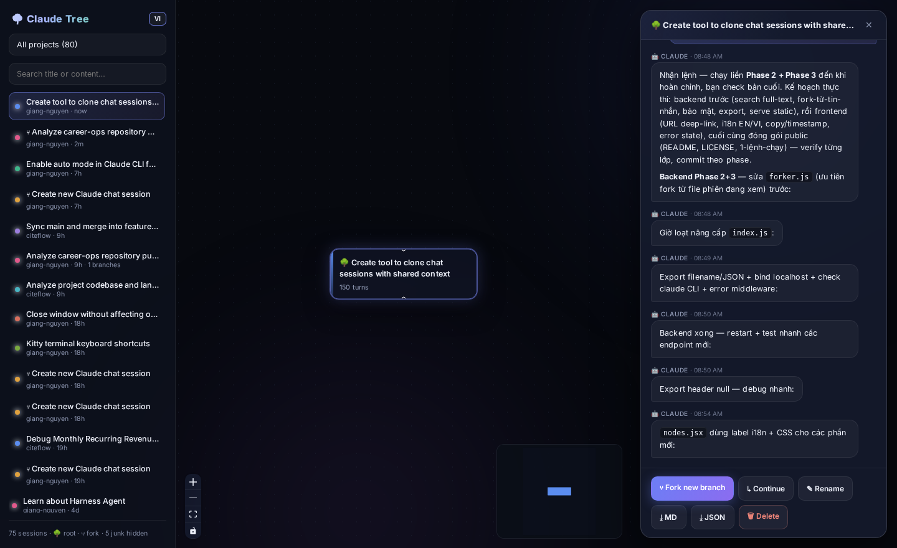

# 🌳 Claude Tree

**Visualize, fork and branch your Claude Code sessions as an interactive tree.**

Ever had a Claude Code conversation reach a point where you wanted to explore *several
directions at once* — without polluting the main session's context? Claude Tree turns your
sessions into a visual tree: every node is a session, every edge is a fork. Click any
session, fork from its tip **or from any message in the middle**, and keep chatting in the
new branch while the original stays untouched.



## Features

- 🌳 **Session tree** — auto-detects fork relationships across all your Claude Code projects
  (forks share message UUIDs with their parent; no extra bookkeeping needed)
- ⑂ **Fork → Terminal** — forking opens a real terminal (kitty/gnome-terminal/konsole/…)
  running `claude --resume` on the new branch: chat with the full CLI experience (tool
  permissions, slash commands, MCP). The web app visualizes; the terminal is where you work.
  Works from a session's tip or from any message (hover ⑂). Override emulator with
  `CLAUDE_TREE_TERMINAL`.
- ⚡ **Quick chat** — for one-off questions there's also an in-app headless composer (SSE
  streaming)
- 📖 **Readable conversations** — markdown rendering, tool-call noise filtered out, inherited
  parent messages collapsed behind a toggle
- 🔍 **Full-text search** — search inside conversation *content* across every session
- 🔗 **Deep links** — `#/s/<project>/<session>` survives refresh, shareable
- ⤓ **Export** — Markdown or JSON, filename from the session title
- 🌐 **Vietnamese / English** UI toggle

## Quickstart

Requires **Node.js ≥ 18** and the [Claude Code CLI](https://docs.anthropic.com/en/docs/claude-code)
(`claude`) logged in.

```bash
git clone <this-repo> claude-tree && cd claude-tree
npm run setup     # installs server + web deps, builds the frontend
npm start         # → http://localhost:4799
```

For development (hot reload):

```bash
./start.sh        # backend :4799 + Vite dev server → http://localhost:5174
```

## Configuration

| Env var | Default | Meaning |
|---|---|---|
| `PORT` | `4799` | API/app port |
| `CLAUDE_PROJECTS_DIR` | `~/.claude/projects` | Where Claude Code stores session JSONL files |

## How forking works (and why it's safe)

Claude Code stores each session as a JSONL file under `~/.claude/projects/<project>/`.
Its native `--fork-session` copies the conversation prefix into a **new** session file,
keeping the original message UUIDs. Claude Tree uses the same mechanism:

- **Fork from tip** → resumes the session with `--fork-session`
- **Fork from a middle message** → synthesizes a new JSONL containing only the prefix up to
  that message, then resumes it

Your original session file is **never modified**. Deleting a session moves the file to
`server/.trash/` (recoverable), it is never erased outright.

## Security notes

This app reads your **entire Claude Code chat history** — treat it accordingly:

- The server binds to `127.0.0.1` only and CORS is restricted to localhost origins.
- Do not reverse-proxy it to the internet without adding authentication.
- `Chat`/`Fork` spawn the `claude` CLI under your account and consume API usage.

## Troubleshooting

- **"Cannot reach backend"** → run `npm start` (or `./start.sh` for dev) and retry.
- **Chat/Fork errors** → make sure `claude --version` works in your terminal; the server
  logs a warning at startup if the CLI is missing.
- **Port in use** → `PORT=5000 npm start`.
- **First content-search is slow** → it scans every session file once, then caches by mtime.

## Architecture

```
server/   Express API (Node, no DB)
  treeBuilder.js  scan JSONL → session forest (fork detection via shared UUIDs)
  forker.js       fork-at-any-message (prefix synthesis, original untouched)
  index.js        REST + SSE streaming (spawns `claude -p --output-format stream-json`)
web/      React + Vite
  React Flow + elkjs (tree canvas) · GSAP (motion) · Lottie (empty state)
  react-markdown (conversation rendering)
```

---

## 🇻🇳 Tiếng Việt

**Claude Tree** biến các phiên chat Claude Code thành cây trực quan: mỗi node là một phiên,
mỗi cạnh là một lần fork. Chọn phiên → xem hội thoại → **⑂ Fork** (từ cuối phiên hoặc từ
bất kỳ tin nhắn nào) → chat tiếp trong nhánh mới, phiên gốc luôn nguyên vẹn.

```bash
npm run setup && npm start   # → http://localhost:4799
```

- Tìm kiếm full-text trong nội dung mọi phiên; deep-link sống qua F5
- Tin nhắn kế thừa từ phiên cha được gập gọn; markdown render đầy đủ
- Export Markdown/JSON; đổi ngôn ngữ VI/EN ở góc sidebar
- Xóa phiên = chuyển vào `server/.trash/`, khôi phục được

## License

MIT © 2026 Giang Nguyen
